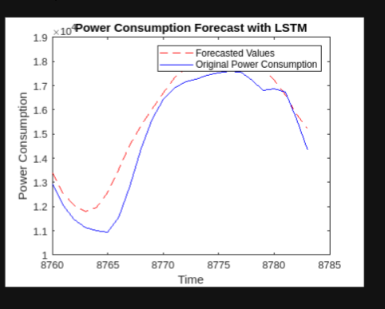
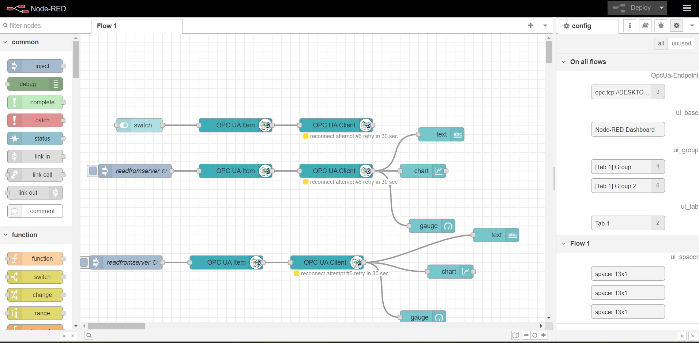

# Project Title

This project demonstrates the integration of Azure Blob Storage, MATLAB, and OPC UA with Node-RED for real-time power consumption forecasting. The project includes the uploading of power consumption data into Azure Blob Storage and subsequently loading the data into MATLAB for forecasting.

## Setup Instructions

### Step 1: Setting up Azure Blob Storage and Accessing Data from MATLAB

1. **Create Azure Account:** Sign up for a Microsoft Azure account if you don't have one.
2. **Create Storage Account:** Create a new storage account in the Azure portal.
3. **Set up Blob Container:** Inside the created storage account, create a Blob container to store the power consumption data.
4. **Generate Access Keys:** Obtain the access keys for the storage account to authenticate the data upload.
5. **Configure Storage Access:** Configure the necessary permissions and access control for the Blob container.

6. **Access Data from MATLAB:** Utilize the MATLAB to access the uploaded data from the Azure Blob Storage. Implement the necessary code to load the data into MATLAB for further processing.

   
   

### Step 2: Forecasting Using LSTM

1. **Install MATLAB:** If not already installed, download and install MATLAB on your local machine.
2. **Load Data:** Use the Azure Storage SDK for MATLAB to load the power consumption data from the Azure Blob Storage.
3. **Preprocess Data:** Prepare the loaded data for input into the LSTM model by performing necessary preprocessing steps.
4. **Train LSTM Model:** Train the LSTM model using the prepared data to learn the patterns and trends in the power consumption dataset.
5. **Perform Forecasting:** Utilize the trained LSTM model to forecast the power consumption for the next 24 hours.

   

### Step 3: Sending Forecasted Data to OPC UA Server and Displaying in Node-RED

1. **Initialize OPC UA Server:** Set up an OPC UA server, such as Prosys, to receive data from your MATLAB application.
2. **Send Forecasted Data:** After performing the LSTM forecasting, send the forecasted data for the next 24 hours to the OPC UA server.
3. **Node-RED Integration:** Configure Node-RED to connect to the OPC UA server and retrieve the forecasted data.
4. **Dashboard Visualization:** Create a Node-RED dashboard that displays the forecasted power consumption data on a chart or visualization tool.
5. **Real-Time Display:** Ensure that the Node-RED dashboard updates in real-time to provide an accurate representation of the forecasted data.

   
   

### Overall Workflow of the Project

This project showcases an automated workflow that enables real-time power consumption forecasting. The workflow begins with a user clicking a button on the Node-RED dashboard. The request is then sent to the OPC UA server, which subsequently transmits the request to MATLAB(it is a client). MATLAB accesses the Azure Blob Storage to retrieve the relevant power consumption data. After preprocessing the data, MATLAB loads the pre-trained model and performs the power consumption forecast. The forecasted data and also true data is sent back to the OPC UA server, which, in turn, relays the data to Node-RED. Finally, Node-RED receives the forecasted data and displays it on the dashboard, providing users with valuable insights.

